# 实验报告 001: LongLive 物理场景 Baseline 生成

**日期**: 2026-03-12
**目的**: 评估 LongLive (Wan2.1-T2V-1.3B) 在流体/软体/布料/刚体四类物理场景下的生成质量，建立 GRPO 后训练前的 baseline

## 复现信息

- **Commit**: `9b10356` (feat: add physics baseline inference config)
- **硬件**: 1× NVIDIA RTX 5090 (32GB), GPU 7
- **Conda 环境**: `wan2` (Python 3.11.14, PyTorch 2.10.0)
- **推理配置**: `configs/physics_baseline_inference.yaml`
- **运行命令**:
```bash
ssh 5090
source /data/Anaconda3/etc/profile.d/conda.sh && conda activate wan2
cd ~/world-model && git checkout 9b10356
cd LongLive
CUDA_VISIBLE_DEVICES=7 torchrun --nproc_per_node=1 --master_port=29501 \
  inference.py --config_path ../configs/physics_baseline_inference.yaml
```

### 关键参数

| 参数 | 值 |
|------|-----|
| 模型 | Wan2.1-T2V-1.3B + LongLive LoRA (rank=256) |
| Denoising steps | [1000, 750, 500, 250] |
| 输出帧数 | 120 frames (~16fps) |
| 分辨率 | 832×480 |
| Seed | 42 |
| 每条 prompt 耗时 | ~69s |
| 总耗时 | 23 min (20 prompts) |

### Prompt 列表

来源: `scripts/physics_prompts.txt`, 共 20 条, 按物理类型分为 4 组:

| 编号 | 类型 | Prompt |
|------|------|--------|
| 0 | 流体 | A glass of water being slowly poured from a pitcher |
| 1 | 流体 | Thick smoke rising from a candle flame, swirling and dispersing |
| 2 | 流体 | A waterfall cascading down rocks into a pool |
| 3 | 流体 | A cup of coffee being stirred with a spoon |
| 4 | 流体 | Rain drops falling into a puddle, creating expanding circular ripples |
| 5 | 软体 | A soft jelly cube wobbling on a white plate after being gently poked |
| 6 | 软体 | A rubber ball dropped onto a hard floor, bouncing and deforming |
| 7 | 软体 | A balloon filled with water being squeezed by a hand |
| 8 | 软体 | A piece of soft clay being pressed flat by a hand |
| 9 | 软体 | An elastic rubber band being stretched and released |
| 10 | 布料 | A red flag waving in strong wind on a flagpole |
| 11 | 布料 | A white tablecloth being pulled off a table in slow motion |
| 12 | 布料 | A silk curtain blowing gently in a breeze |
| 13 | 布料 | A bedsheet being shaken out and floating down onto a bed |
| 14 | 布料 | A piece of paper falling through the air, fluttering and spinning |
| 15 | 刚体 | A bowling ball rolling down a lane and striking the pins |
| 16 | 刚体 | A pendulum swinging back and forth in a grandfather clock |
| 17 | 刚体 | Two billiard balls colliding on a green pool table |
| 18 | 刚体 | A basketball bouncing on a wooden court floor |
| 19 | 刚体 | A stack of wooden blocks being knocked over by a marble |

## 结果

输出视频位于 5090 服务器: `~/world-model/outputs/physics_baseline/rank0-{0..19}-0_lora.mp4`
帧截图位于: `outputs/physics_baseline/frames/{0..19}_strip.jpg` (每个视频等间隔抽 8 帧横向拼接)

### 流体 (0-4)

**#0 倒水**

- 液体越倒越多直接溢出，后期变成白色泡沫糊成一片
- **流体体积守恒完全崩溃**

**#1 烟雾**

- 烟雾初期扩散合理，但后期出现不自然的环状结构
- 扩散速率和密度衰减不符合物理

**#2 瀑布**
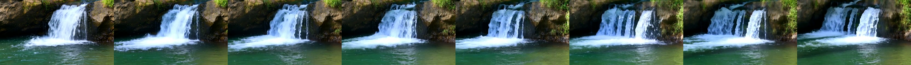
- 视觉效果尚可，但水流几乎是静态纹理复制
- 缺少真实湍流和水花动态

**#3 咖啡搅拌**

- 漩涡形态不错，但搅拌动力学不对
- 勺子消失又出现，液面混合没有物理衰减过程

**#4 雨滴涟漪**
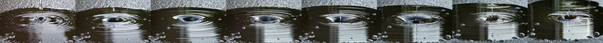
- 涟漪同心圆基本合理
- 波传播速度和衰减幅度不符合水波物理

### 软体 (5-9)

**#5 果冻**
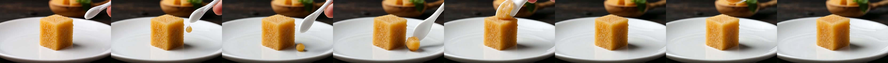
- 外观像蛋糕而非果冻，**完全没有弹性形变**
- 勺子凭空出现，戳的动作和果冻响应不匹配

**#6 弹力球**
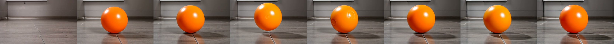
- 球基本不动，**没有弹跳轨迹**
- 8帧中球的位置几乎一致，完全缺少弹跳运动

**#7 水气球**
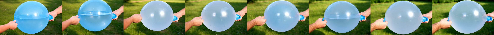
- 气球在膨胀而非被挤压，**形变方向完全反了**
- 没有水的重力导致的下垂变形

**#8 黏土**
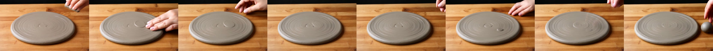
- 变成了扁平圆盘（已经按好了），手在上面触摸而非按压
- **没有可塑性形变过程**

**#9 橡皮筋**
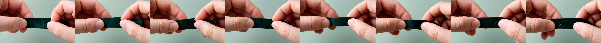
- 手指拉着不动，**完全没有拉伸-回弹过程**
- 弹性动力学为零

### 布料 (10-14)

**#10 旗帜**

- 飘动幅度合理，褶皱有变化
- 但帧间有跳变，旗帜形状不连续

**#11 桌布**
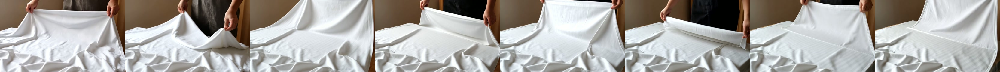
- 有拉扯动作，布料有一定褶皱
- 但布料形变和重力响应不自然

**#12 丝帘**
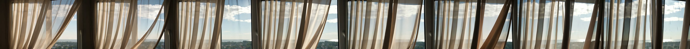
- 飘动效果尚可
- 帘子间的遮挡关系混乱，透明度不一致

**#13 床单**

- 语义理解错误：变成人在铺床，而非床单飘落
- **床单飘落的空气动力学完全没有体现**

**#14 纸片飘落**
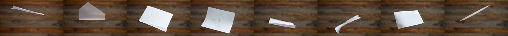
- 有翻转和飘落运动，是所有场景中**最接近物理正确**的一个
- 但纸片大小帧间不一致

### 刚体 (15-19)

**#15 保龄球**
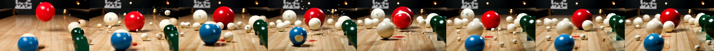
- 场景理解完全错误：生成了散落的台球/彩球，不是保龄球道
- 碰撞后物体数量和位置不守恒

**#16 钟摆**
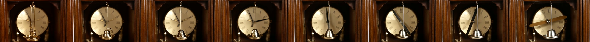
- 摆锤有左右摆动
- 但摆锤**形状不断变化**（从金属球变成木棍），质量/形状不守恒

**#17 台球**
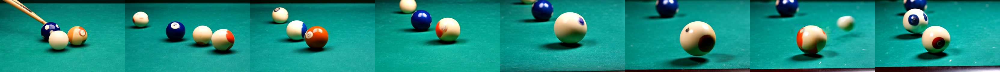
- 碰撞后有球运动
- 但球的数量帧间不一致，运动方向不符合动量守恒

**#18 篮球**
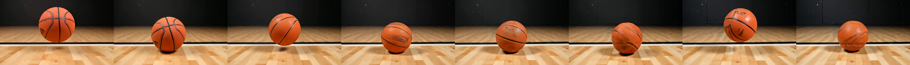
- 球几乎不弹，8帧中位置基本一致
- **弹跳动力学完全缺失**，每次弹跳应该越来越低

**#19 积木**

- 弹珠从上方落下，但**积木始终不倒**
- 碰撞响应为零

## 总结

### 物理一致性评分 (主观 1-5, 5=物理正确)

| 类型 | 平均分 | 主要问题 |
|------|--------|----------|
| 流体 (0-4) | 2.2 | 体积不守恒、衰减缺失、纹理复制代替真实流动 |
| 软体 (5-9) | 1.0 | 弹性形变几乎为零、运动学完全缺失 |
| 布料 (10-14) | 2.4 | 褶皱有但不自然、空气动力学缺失 |
| 刚体 (15-19) | 1.6 | 碰撞响应缺失、物体守恒性差 |

### 关键发现

1. **软体场景表现最差 (1.0/5)**: 模型完全不理解弹性形变、弹跳、拉伸等软体力学。这是可微物理模拟器奖励最有潜力改进的方向。
2. **流体和布料中等 (2.2-2.4/5)**: 有一定视觉合理性但缺少物理正确性（守恒律、衰减、湍流）。
3. **刚体也很差 (1.6/5)**: 碰撞检测和响应几乎不存在，动量/角动量不守恒。
4. **视觉质量 vs 物理质量脱节**: 模型擅长生成"看起来像"的静态纹理，但不理解物理过程的时序动态。

### 对研究方向的启示

- 软体和流体场景的物理违规最明显，用 Warp SPH/FEM 作为奖励信号有最大的改进空间
- 纸片飘落 (#14) 显示模型具备一定运动学能力，说明通过奖励信号引导是可行的
- Baseline 足够差，GRPO 后训练即使小幅改进也能产生显著对比
